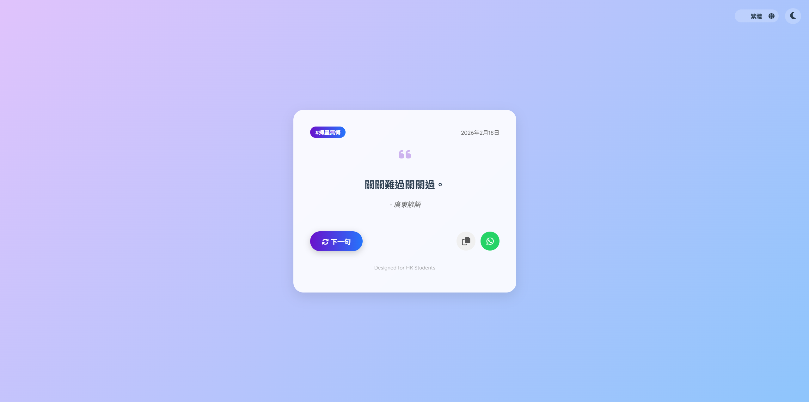
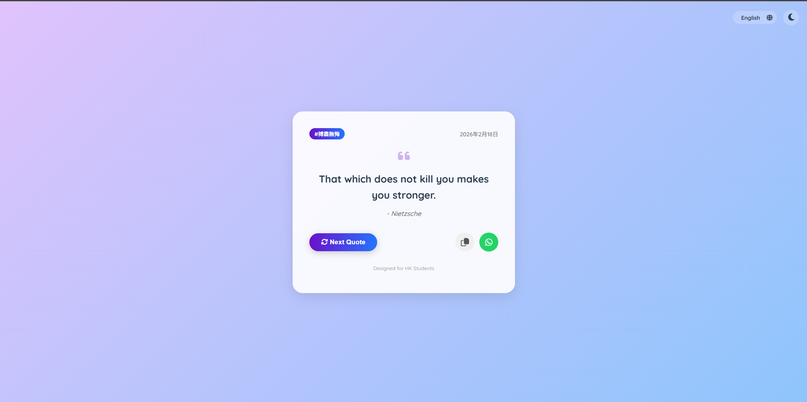

# 🎓 Daily Motivation for HK Students

> A modern, responsive web application designed to boost morale for Hong Kong students facing exam pressure, featuring multi-language support and a serverless architecture.


## 🔗 Live Demo

### 🚀 [**Click Here to View Live Project**](https://kelvin0611.github.io/motivate-quote-generator/)

> **Note**: The application is hosted on GitHub Pages and runs entirely client-side.

---

## 📸 Interface Previews

| **Quote View (Light/Dark)** | **Mobile Responsiveness** |
|:---:|:---:|
|  |  |

---


---

## 📖 About The Project

This project started as a simple random quote machine but evolved into a full-featured Progressive Web App (PWA) tailored for students in Hong Kong, particularly those preparing for the **HKDSE** (Hong Kong Diploma of Secondary Education).

The application addresses the need for mental support and encouragement during stressful exam periods by delivering daily motivational quotes in a soothing, aesthetically pleasing interface.

**Technical Highlight:**
Instead of a traditional backend, this project utilizes **Google Sheets as a Headless CMS**. This allows non-technical administrators to update quotes dynamically without redeploying the code. It implements a **JSONP (JSON with Padding)** strategy to fetch data directly from Google servers, effectively bypassing browser CORS (Cross-Origin Resource Sharing) restrictions without requiring a proxy server.

## ✨ Key Features

* **🎨 Glassmorphism UI:** A modern, frosted-glass aesthetic with smooth transitions and animations.
* **🌓 Smart Theming:** Auto-detects system color preferences (Dark/Light mode) with a manual toggle switch.
* **🌐 Multi-Language Support:**
    * Traditional Chinese (Targeting HK locals)
    * English
    * Simplified Chinese
* **⚡ Serverless Architecture:** Powered entirely by Google Sheets.
* **🔧 CORS-Free Data Fetching:** Uses script tag injection (JSONP) to read data, ensuring reliability across all browsers and devices.
* **📱 Fully Responsive:** Optimized for mobile, tablet, and desktop views.
* **📤 Social Integration:** Features one-click copying to clipboard and direct sharing to WhatsApp with dynamic, context-aware hashtags.

## 🛠️ Tech Stack

* **Frontend:** HTML5, CSS3 (Custom Variables), JavaScript (jQuery)
* **Data Source:** Google Sheets (via Google Visualization API)
* **Styling:** FontAwesome (Icons), Animate.css, Google Fonts (Noto Sans TC, Quicksand)
* **Deployment:** GitHub Pages / Vercel

## ⚙️ Configuration (Database Setup)

To deploy your own version of this app, you need a Google Sheet formatted specifically for the parser.

1.  Create a new Google Sheet.
2.  Ensure the **first row** acts as the header.
3.  Fill the columns in the exact order (**A to F**) as shown below:

| Column | Key | Description |
| :--- | :--- | :--- |
| **A** | `quote_tc` | Traditional Chinese Quote |
| **B** | `author_tc` | Traditional Chinese Author |
| **C** | `quote_en` | English Quote |
| **D** | `author_en` | English Author |
| **E** | `quote_sc` | Simplified Chinese Quote |
| **F** | `author_sc` | Simplified Chinese Author |

*Note: The script automatically fetches data from `gid=0` (the first tab of the spreadsheet).*

## 🚀 How to Run Locally

1.  **Clone the repository**
    ```sh
    git clone [https://github.com/your-username/your-repo-name.git](https://github.com/your-username/your-repo-name.git)
    ```
2.  **Open the project**
    Simply open `index.html` in any modern web browser.
3.  **Connect your data**
    Open `js/index.js` and update the `yourSheetID` variable with the ID from your own Google Sheet URL.

## 📄 License

Distributed under the MIT License. See `LICENSE` for more information.

---
<p align="center">Designed with ❤️ for Students</p>
